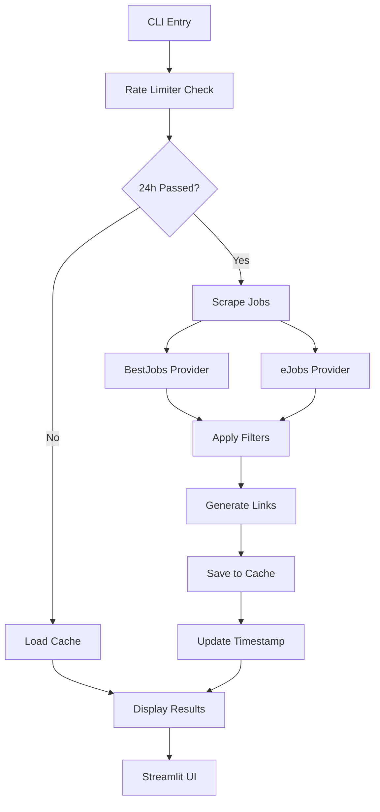

# Developer Guide

This guide provides detailed information for developers working on PyJobber, including architecture decisions, design patterns, and contribution guidelines.

## Table of Contents

- [Architecture Overview](#architecture-overview)
- [Design Patterns](#design-patterns)
- [Development Workflow](#development-workflow)
- [Adding New Features](#adding-new-features)
- [Testing Strategy](#testing-strategy)
- [Code Standards](#code-standards)
- [Deployment](#deployment)

## Architecture Overview

PyJobber follows a modular, layered architecture designed for maintainability and extensibility.

### Architectural Principles

1. **Separation of Concerns**: Each module has a single responsibility
2. **Dependency Injection**: Providers are injected into the scraper
3. **Interface Segregation**: Abstract base classes define clear contracts
4. **Open/Closed Principle**: Easy to extend with new providers without modifying existing code
5. **Single Responsibility**: Each class/function has one reason to change

### Layer Breakdown

```
┌─────────────────────────────────────────────┐
│                CLI Layer                    │
│              (main.py)                      │
└─────────────────┬───────────────────────────┘
                  │
┌─────────────────▼───────────────────────────┐
│              UI Layer                       │
│         (ui/streamlit_app.py)               │
└─────────────────┬───────────────────────────┘
                  │
┌─────────────────▼───────────────────────────┐
│            Business Logic                   │
│        (core/scraper.py, core/filters.py)  │
└─────────────┬──────────────┬────────────────┘
              │              │
┌─────────────▼──────────────▼────────────────┐
│         Data Access Layer                   │
│    (providers/*, storage/csv_handler.py)    │
└─────────────────┬───────────────────────────┘
                  │
┌─────────────────▼───────────────────────────┐
│          Infrastructure                     │
│       (utils/rate_limiter.py, APIs)        │
└─────────────────────────────────────────────┘
```

### Data Flow



## Design Patterns

### 1. Strategy Pattern (Providers)

Each job site is implemented as a separate provider class implementing the `JobProvider` interface.

```python
# Abstract Strategy
class JobProvider(ABC):
    @abstractmethod
    def fetch_jobs(self) -> List[Dict[str, Any]]:
        pass

# Concrete Strategies  
class BestJobsProvider(JobProvider): ...
class EJobsProvider(JobProvider): ...
```

**Benefits:**
- Easy to add new job sites
- Isolated failure (one provider failure doesn't affect others)
- Different logic for different APIs

### 2. Template Method Pattern (Scraping)

The main scraping workflow follows a template with customizable steps:

```python
def scrape_jobs():
    # Template method
    providers = initialize_providers()  # Customizable
    for provider in providers:
        raw_data = provider.fetch_jobs()  # Customizable
        processed_data = process_data(raw_data)  # Fixed
        filtered_data = apply_filters(processed_data)  # Fixed
```

### 3. Factory Pattern (Provider Creation)

```python
def create_provider(provider_type: str) -> JobProvider:
    if provider_type == 'bestjobs':
        return BestJobsProvider()
    elif provider_type == 'ejobs':
        return EJobsProvider()
    raise ValueError(f"Unknown provider: {provider_type}")
```

### 4. Repository Pattern (Storage)

Storage operations are abstracted through the `csv_handler` module:

```python
# Abstract repository operations
def save_jobs_to_csv(df_bjobs, df_ejobs, external_jobs): ...
def load_jobs_from_csv(): ...
def csv_files_exist(): ...
```

### 5. Facade Pattern (Main Interface)

The `run_scraper_or_load_cache()` function provides a simple facade over complex operations:

```python
def run_scraper_or_load_cache():
    # Hides complexity of rate limiting, caching, error handling
    if check_last_run():
        return scrape_and_cache()
    else:
        return load_from_cache()
```

## Development Workflow

### 1. Environment Setup

```bash
# Clone repository
git clone <repo-url>
cd PyJobber

# Install dependencies
uv sync

# Verify setup
uv run python main.py --help
```

### 2. Development Commands

```bash
# Run scraper in development
uv run python main.py --scrape

# Launch dashboard
uv run streamlit main.py --streamlit

# Test imports
uv run python -c "from src.pyjobber.core.scraper import scrape_jobs; print('OK')"

# Run with verbose logging (modify provider files)
# Add print statements or configure logging
```

### 3. Code Organization

```
src/pyjobber/
├── __init__.py           # Package initialization
├── core/                 # Business logic
│   ├── __init__.py
│   ├── scraper.py        # Main orchestration
│   └── filters.py        # Data filtering
├── providers/            # External APIs
│   ├── __init__.py
│   ├── base.py          # Interface definition
│   ├── bestjobs.py      # BestJobs implementation
│   └── ejobs.py         # eJobs implementation  
├── storage/              # Data persistence
│   ├── __init__.py
│   └── csv_handler.py   # CSV operations
├── ui/                   # User interfaces
│   ├── __init__.py
│   └── streamlit_app.py # Web dashboard
└── utils/                # Utilities
    ├── __init__.py
    └── rate_limiter.py  # Rate limiting
```

## Adding New Features

### Adding a New Job Provider

1. **Create Provider Class:**

```python
# src/pyjobber/providers/newsite.py
import requests
from typing import List, Dict, Any
from .base import JobProvider

class NewSiteProvider(JobProvider):
    def __init__(self, api_key=None):
        self.api_key = api_key
        self.base_url = "https://api.newsite.com"
    
    def fetch_jobs(self) -> List[Dict[str, Any]]:
        """Fetch jobs from NewSite API."""
        try:
            response = requests.get(
                f"{self.base_url}/jobs",
                headers={'Authorization': f'Bearer {self.api_key}'},
                timeout=30
            )
            response.raise_for_status()
            return response.json()['jobs']
        except Exception as e:
            print(f"[ERROR] NewSite API error: {e}")
            raise
    
    def get_required_columns(self) -> List[str]:
        return ['id', 'title', 'company', 'description']
    
    def create_job_link(self, job_data: Dict[str, Any]) -> str:
        return f"https://newsite.com/jobs/{job_data['id']}"
```

2. **Update Scraper:**

```python
# src/pyjobber/core/scraper.py
from ..providers.newsite import NewSiteProvider

def scrape_jobs():
    # Add new provider
    newsite_provider = NewSiteProvider(api_key=os.getenv('NEWSITE_API_KEY'))
    
    # Fetch and process
    newsite_data = newsite_provider.fetch_jobs()
    df_newsite = pd.DataFrame(newsite_data)
    # ... rest of processing
```

3. **Update Storage (if needed):**

```python
# src/pyjobber/storage/csv_handler.py
def save_jobs_to_csv(df_bjobs, df_ejobs, df_newsite, external_jobs=None):
    # Add new CSV file
    df_newsite.to_csv(os.path.join(cache_dir, 'newsite.csv'), index=False)
```

### Adding New Filtering Options

1. **Extend Filter Module:**

```python
# src/pyjobber/core/filters.py
def filter_by_salary_range(df, min_salary=None, max_salary=None):
    """Filter jobs by salary range."""
    if 'salary' not in df.columns:
        return df
    
    mask = pd.Series([True] * len(df))
    if min_salary:
        mask &= df['salary'] >= min_salary
    if max_salary:
        mask &= df['salary'] <= max_salary
    
    return df[mask]

def filter_by_location(df, allowed_locations):
    """Filter jobs by location."""
    if 'location' not in df.columns:
        return df
    
    mask = df['location'].isin(allowed_locations)
    return df[mask]
```

2. **Update Configuration:**

```python
# data/config.json (new file)
{
    "filters": {
        "banned_words_file": "data/banned_words.txt",
        "salary_range": {
            "min": 30000,
            "max": 150000
        },
        "allowed_locations": ["Bucharest", "Cluj", "Remote"]
    }
}
```

### Adding New UI Components

1. **Extend Streamlit App:**

```python
# src/pyjobber/ui/streamlit_app.py
def add_filter_sidebar():
    """Add filtering sidebar to Streamlit app."""
    st.sidebar.header("Filters")
    
    # Salary filter
    salary_range = st.sidebar.slider(
        "Salary Range (EUR)",
        min_value=20000,
        max_value=200000,
        value=(30000, 100000)
    )
    
    # Location filter
    locations = st.sidebar.multiselect(
        "Locations",
        options=["Bucharest", "Cluj", "Timisoara", "Remote"],
        default=["Bucharest", "Remote"]
    )
    
    return {"salary_range": salary_range, "locations": locations}

def run_streamlit_dashboard():
    st.title("PyJobber - Job Listings Dashboard")
    
    # Add filters
    filters = add_filter_sidebar()
    
    # Apply filters to data
    # ... existing code with filter application
```

## Testing Strategy

### Manual Testing

1. **Unit Testing Commands:**

```bash
# Test individual components
uv run python -c "
from src.pyjobber.providers.bestjobs import BestJobsProvider
provider = BestJobsProvider()
print('BestJobs provider created successfully')
"

# Test data loading
uv run python -c "
from src.pyjobber.storage.csv_handler import csv_files_exist
print(f'CSV files exist: {csv_files_exist()}')
"
```

2. **Integration Testing:**

```bash
# Test full pipeline with cache
uv run python main.py --scrape

# Test dashboard
uv run streamlit main.py --streamlit
```

3. **Error Scenario Testing:**

```bash
# Test with missing banned words file
mv data/banned_words.txt data/banned_words.txt.bak
uv run python main.py --scrape
mv data/banned_words.txt.bak data/banned_words.txt

# Test with corrupted cache
echo "invalid,csv,data" > data/cache/bjobs.csv
uv run python main.py
```

### Automated Testing Framework

Create a basic test structure:

```python
# tests/test_providers.py
import unittest
from unittest.mock import patch, MagicMock
from src.pyjobber.providers.bestjobs import BestJobsProvider

class TestBestJobsProvider(unittest.TestCase):
    def setUp(self):
        self.provider = BestJobsProvider()
    
    @patch('requests.get')
    def test_fetch_jobs_success(self, mock_get):
        # Mock API response
        mock_response = MagicMock()
        mock_response.json.return_value = {
            'total': 1,
            'items': [{'id': 1, 'title': 'Test Job'}]
        }
        mock_get.return_value = mock_response
        
        jobs = self.provider.fetch_jobs()
        self.assertEqual(len(jobs), 1)
        self.assertEqual(jobs[0]['title'], 'Test Job')
    
    def test_create_job_link(self):
        job_data = {'slug': 'test-job-123'}
        link = self.provider.create_job_link(job_data)
        expected = 'https://www.bestjobs.eu/loc-de-munca/test-job-123'
        self.assertEqual(link, expected)

if __name__ == '__main__':
    unittest.main()
```

## Code Standards

### 1. Python Style

- Follow PEP 8 style guide
- Use type hints for all function parameters and return values
- Maximum line length: 88 characters (Black formatter standard)
- Use descriptive variable names

### 2. Function Documentation

```python
def filter_jobs_by_banned_words(df: pd.DataFrame, banned_words_file: str = "data/banned_words.txt") -> pd.DataFrame:
    """
    Filter job DataFrame by removing entries with banned words in titles.
    
    Args:
        df: Input DataFrame containing job data with 'title' column
        banned_words_file: Path to file containing banned words (one per line)
    
    Returns:
        Filtered DataFrame with banned jobs removed
    
    Raises:
        FileNotFoundError: If banned words file doesn't exist
        KeyError: If 'title' column is missing from DataFrame
    
    Example:
        >>> jobs_df = pd.DataFrame({'title': ['Software Engineer', 'Sales Manager']})
        >>> filtered = filter_jobs_by_banned_words(jobs_df)
        >>> len(filtered)  # Depends on banned words configuration
        1
    """
```

### 3. Error Handling

```python
def fetch_jobs(self) -> List[Dict[str, Any]]:
    """Fetch jobs with comprehensive error handling."""
    try:
        response = requests.get(self.api_url, timeout=30)
        response.raise_for_status()
        
        data = response.json()
        if 'jobs' not in data:
            raise KeyError("'jobs' key missing from API response")
        
        return data['jobs']
        
    except requests.exceptions.ConnectionError as e:
        print(f"[ERROR] Connection failed: {e}")
        raise
    except requests.exceptions.Timeout as e:
        print(f"[ERROR] Request timeout: {e}")
        raise
    except requests.exceptions.HTTPError as e:
        print(f"[ERROR] HTTP error {e.response.status_code}: {e}")
        raise
    except KeyError as e:
        print(f"[ERROR] Invalid API response format: {e}")
        raise
    except Exception as e:
        print(f"[ERROR] Unexpected error: {e}")
        raise
```

### 4. Logging Standards

```python
# Use consistent logging prefixes
print(f"[INFO] Starting operation...")
print(f"[SUCCESS] Operation completed: {result}")
print(f"[WARNING] Non-critical issue: {warning}")
print(f"[ERROR] Operation failed: {error}")
print(f"[DEBUG] Debug info: {debug_data}")
```

### 5. Configuration Management

```python
# Use environment variables for secrets
import os

API_KEY = os.getenv('BESTJOBS_API_KEY')
if not API_KEY:
    raise ValueError("BESTJOBS_API_KEY environment variable required")

# Use constants for configuration
DEFAULT_CACHE_DIR = "data/cache"
DEFAULT_BANNED_WORDS_FILE = "data/banned_words.txt"
RATE_LIMIT_HOURS = 24
```

## Deployment

### Production Considerations

1. **Environment Variables:**

```bash
# Required for production
export BESTJOBS_API_KEY="your-api-key"
export EJOBS_API_KEY="your-api-key"  # if needed
export PYJOBBER_CACHE_DIR="/var/cache/pyjobber"
export PYJOBBER_LOG_LEVEL="INFO"
```

2. **Systemd Service (Linux):**

```ini
# /etc/systemd/system/pyjobber.service
[Unit]
Description=PyJobber Job Scraper
After=network.target

[Service]
Type=oneshot
User=pyjobber
WorkingDirectory=/opt/pyjobber
Environment=BESTJOBS_API_KEY=your-key-here
ExecStart=/usr/local/bin/uv run python main.py --scrape
StandardOutput=journal
StandardError=journal

[Install]
WantedBy=multi-user.target
```

3. **Cron Job:**

```bash
# Run every 24 hours at 2 AM
0 2 * * * cd /opt/pyjobber && /usr/local/bin/uv run python main.py --scrape >> /var/log/pyjobber.log 2>&1
```

4. **Docker Deployment:**

```dockerfile
FROM python:3.9-slim

# Install uv
RUN pip install uv

WORKDIR /app
COPY . .

# Install dependencies
RUN uv sync

# Create cache directory
RUN mkdir -p data/cache

# Run scraper
CMD ["uv", "run", "python", "main.py", "--scrape"]
```

### Monitoring

1. **Health Checks:**

```python
# src/pyjobber/utils/health.py
def health_check():
    """Basic health check for monitoring."""
    checks = {
        'cache_directory': os.path.exists('data/cache'),
        'banned_words_file': os.path.exists('data/banned_words.txt'),
        'last_run_file': os.path.exists('last_run.txt')
    }
    
    return {
        'status': 'healthy' if all(checks.values()) else 'unhealthy',
        'checks': checks,
        'timestamp': datetime.now().isoformat()
    }
```

2. **Metrics Collection:**

```python
# Track scraping metrics
metrics = {
    'jobs_scraped': len(df_bjobs) + len(df_ejobs),
    'jobs_filtered': initial_count - final_count,
    'scraping_duration_seconds': end_time - start_time,
    'providers_successful': successful_providers,
    'providers_failed': failed_providers
}
```

This developer guide provides the foundation for maintaining and extending PyJobber. The modular architecture makes it easy to add new features while maintaining code quality and reliability.